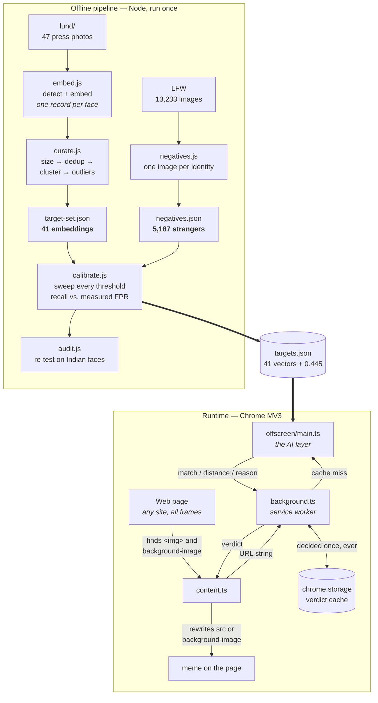
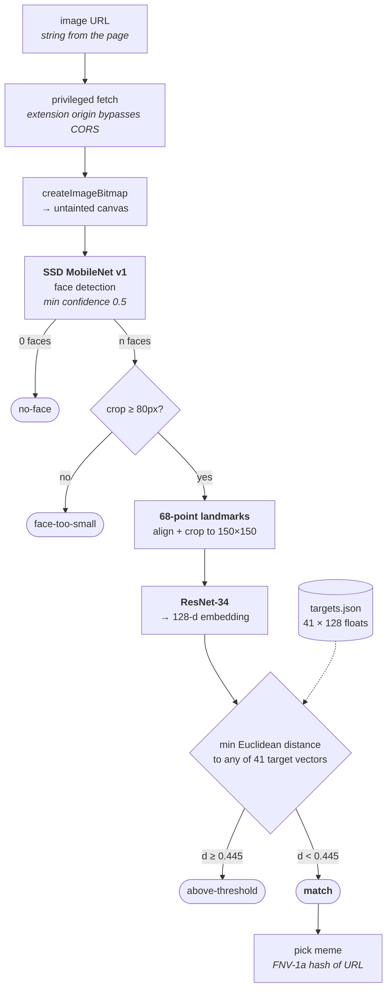

# modihfy

A Chrome extension that finds one specific person's face in images on any website
and replaces those images with memes of him.

All inference runs locally in the browser. No API calls, no server, nothing leaves
the machine — which is also what makes it free to run.

---

## How it works

**No model is trained.** A pretrained face-embedding network (dlib ResNet-34, via
[face-api](https://github.com/vladmandic/face-api)) turns any face into 128 numbers.
Recognising one person is then a nearest-neighbour lookup against vectors computed
once, offline, from photos of him. The only thing ever "learned" is a single scalar:
the distance threshold.

That threshold is the whole product. The published dlib value of 0.6 comes from
**1-vs-1 verification** on clean frontal faces. This extension does **open-set
1-vs-world** matching against thousands of faces per browsing session, so 0.6 would
hit strangers regularly. It was measured instead of assumed.

| | |
|---|---|
| Target embeddings | 41 (from 47 source photos) |
| Negative set | 5,187 LFW identities |
| **Rule** | **distance < 0.445**, no margin, min 80px face |
| Recall | 100% (leave-one-out) |
| False positives | 1 in 5,187 |
| Indian-face audit | 400 faces, nearest 0.498 — passes with 0.053 head-room |

---

## Overall dataflow

Build time produces one file. Runtime consumes it.



Only **strings** ever cross a process boundary — a URL out, a verdict back. That
constraint drives the whole runtime design (see
[Why the offscreen document exists](#why-the-offscreen-document-exists)).

---

## The AI layer

Everything inside the offscreen document, per image. This is the only place that
touches pixels.



Three things worth noting about that path:

- **The 80px gate comes before scoring, not after.** Small crops produce mushy
  descriptors that sit near *everything*, so they are rejected rather than allowed
  to trip the threshold.
- **`reason` is returned even on a miss** (`no-face`, `face-too-small`,
  `above-threshold`). Without it, "no face found" and "the model crashed" are
  indistinguishable from silence, which makes log-only mode useless for diagnosis.
- **Inference is serialised.** Concurrent WebGL work on one context thrashes and
  ends up slower than running the same jobs back to back.

A margin rule also exists in the code — additionally requiring
`d + margin < distance to the nearest bundled hard negative`, on the logic that a
face closer to some stranger than to the target *is* that stranger. It is inert in
the shipped config (`margin: 0`, no bundled negatives) because calibration found it
earned nothing here. It stays because a larger negative set may switch it on.

---

## Why calibration is the centre of gravity

If the separation is not there, no amount of extension code fixes it. The pipeline
guards three traps that each silently *flatter* the result:

- **The target inside the negative set.** LFW is built from mid-2000s news
  photography and contains `Narendra_Modi` — his own portrait scored as the nearest
  "stranger", penalising the sweep for getting the answer right. Excluded by
  identity, and reported when it happens.
- **Fitting and grading on the same data.** The margin rule selects its own hard
  negatives, so negatives are split into fit and holdout halves and the reported
  false-positive rate comes from the half never used for selection.
- **Self-distance in the margin test.** A negative that is itself in the hard set
  scores 0 against it and gets rejected for free. Same-identity vectors are skipped
  when measuring that distance. Removing this circularity changed the answer — the
  margin looked valuable and turned out not to be.

A fourth is why `audit.js` exists: LFW is overwhelmingly Western, so a rate measured
on it alone is optimistic for a target of any other demographic.

### Why each curation step exists

| Step | Removes | On the real set |
|---|---|---|
| Size filter (≥80px crop) | Faces too small to embed reliably | 2 faces |
| Dedup (<0.15 apart) | Re-encodes and resizes of the same photo — catches what byte hashing misses | 3 faces |
| Largest cluster (<0.55) | Bystanders in group shots, wrong-person photos | 2 faces |
| Outlier trim (>0.5 from median) | Stragglers that widen the match radius | 0 faces |

48 detected faces → 41 embeddings, with no manual review of any photo.

---

## Runtime design

### Why the offscreen document exists

The load-bearing decision, forced three times over:

1. **A service worker cannot run the model.** No DOM, no canvas, no WebGL.
2. **A content script cannot get the pixels.** Content scripts have been subject to
   CORS since Chrome 85, so `host_permissions` does *not* grant them a privileged
   fetch — that lives only in extension-origin contexts. And drawing a cross-origin
   `` into a canvas taints it, so the pixels cannot be read back either.
3. **The bytes cannot be shipped between contexts.** `chrome.runtime.sendMessage`
   is JSON-serialised; ArrayBuffers and ImageBitmaps do not survive.

Keeping fetch, decode and inference together means only strings cross boundaries,
and **one** model instance serves the whole browser instead of ~12 MB of weights
plus a WebGL context per tab.

The re-fetch is cheaper than it sounds — the page just loaded the same URL, so it
almost always hits the browser HTTP cache.

### What counts as an image

Two kinds of target, because the obvious one is not enough:

- `` elements, including inside cross-origin iframes (`all_frames: true`, so
  embedded tweets and video cards are covered).
- Elements with an inline `background-image`. Plugins like **imgLiquid** read an
  ``, move its `src` onto the parent's `background-image`, and set the ``
  to `display: none` — so the visible pixels belong to no image element at all and
  the hidden `` measures 0×0. Backgrounds defined only in a stylesheet are
  still missed; catching those means `getComputedStyle` on every element, which is
  far too slow on a large page.

### Deciding early, swapping late

Two `IntersectionObserver`s rather than one:

| Observer | Margin | Job |
|---|---|---|
| prefetch | 1500px | run inference, ahead of the reader |
| viewport | 0px | apply the swap, exactly on arrival |

Doing both at the viewport edge made the swap feel like a stall, because the user
was watching inference happen. Deciding early and applying late means the answer is
already in hand, so the flip is instant. A deliberate 250 ms pause then follows, so
the original registers before the meme lands. Both observers call the same
`maybeSwap()`, which fires only when the verdict *and* visibility conditions both
hold — so ordering does not matter.

### Holding the swap in place

Four things fight a replaced image:

- **`srcset` outranks `src`** → cleared, along with `sizes`.
- **A parent `<picture>` outranks the ``** → its `<source>` elements are blanked.
- **Framework re-renders reassign `src`** → a per-element `MutationObserver`
  re-applies the meme. For background-image targets it watches `style` instead, and
  writes with `!important`.
- **Lazy loading** → decisions are keyed by the URL that was judged, not the
  element. Marking the *element* decided meant an image checked while showing its
  placeholder was never looked at again once the real source arrived.

Meme selection is a uniform choice across all seven, keyed off an FNV-1a hash of the
image URL rather than `Math.random()`. Same spread, but stable — on a feed the
element is destroyed and recreated as you scroll, and a fresh roll each time would
visibly cycle the meme under the reader.

### Message flow

| From | To | Payload |
|---|---|---|
| content | background | `{ type: 'CHECK_IMAGE', url }` |
| background | offscreen | `{ target: 'offscreen', type: 'CHECK_IMAGE', url }` |
| offscreen | background → content | `{ match, distance, reason, error? }` |

`createDocument()` resolving does not mean the offscreen document's script has run,
so the first message can land on nothing. The service worker retries briefly rather
than surfacing that as a permanent failure.

### Performance

| Mechanism | Effect |
|---|---|
| Two `IntersectionObserver`s | Only what the reader approaches is ever inferred |
| Minimum 50×50px | Icons and spacers skipped |
| SVG skip | No intrinsic raster size; fails to decode |
| Debounced `MutationObserver` (250 ms) | A burst of feed insertions costs one scan |
| URL-keyed cache in `chrome.storage.local` | Any image URL decided **once, ever** — toggleable from the popup |
| Serial inference queue | Concurrent WebGL work on one context thrashes |
| One offscreen document | One model load, not one per tab |

### MV3 constraints baked into the manifest

- `content_security_policy.extension_pages` includes `'wasm-unsafe-eval'` —
  TensorFlow.js needs it, and without it model loading fails with an opaque runtime
  error rather than a manifest warning.
- `web_accessible_resources` covers `memes/*` only. The content script writes those
  URLs into the page; models and `targets.json` are read by the offscreen document,
  which needs no such declaration.
- Model weights live in `public/` and load via a **relative** URI. face-api's
  `getModelUris()` only strips `http://` and `https://`, then rejoins with
  `.split('/').filter(Boolean)` — which collapses the `//` in any other scheme.
  An absolute `chrome-extension://<id>/models` comes back out as
  `chrome-extension:/<id>/models`, one slash, unfetchable, surfacing as a bare
  "Failed to fetch". Weights are never `import`ed either; that would inline a
  multi-MB base64 blob or produce an unpredictable hashed filename.

### Detector coupling

The runtime uses **SSD MobileNet v1**, the same detector as calibration. Descriptors
depend on the aligned crop, so switching to `TinyFaceDetector` shifts the embeddings
and silently invalidates the threshold. That swap requires re-running
`npm run calibrate`, not just changing one line.

---

## Setup

```bash
npm install
cd extension && npm install && cd ..

# Model weights ship inside the face-api package rather than this repo.
mkdir -p models extension/public/models
cp node_modules/@vladmandic/face-api/model/{ssd_mobilenetv1,face_landmark_68,face_recognition}_model* models/
cp models/* extension/public/models/

cd extension && npm run build
```

Load `extension/.output/chrome-mv3` as an unpacked extension at `chrome://extensions`
with Developer mode on.

`.output` is a dot-folder, so macOS Finder hides it — use <kbd>Cmd</kbd>+<kbd>Shift</kbd>+<kbd>G</kbd>
in the file picker and paste the path.

## Using it

Ships in **log-only mode**: it decides but does not touch pages, and writes every
verdict to the console. That is deliberate. A false positive is invisible once
swapping is on — a meme is exactly what you expect to see — so the only mode where
the failure you care about is observable is the one where nothing changes.

Browse for a while, watch for a match on anyone who isn't the target, then enable
**Replace matched images** from the popup.

The popup also toggles the verdict cache. On, each image URL is decided once ever
and repeat visits swap instantly. Off, every image is re-inferred, so the original
stays visible for a beat before the meme lands.

## Offline pipeline

Requires your own photos in `lund/` — the originals are scraped press images and are
not redistributed here. The output they produced is committed as
`extension/public/targets.json`, so the extension works without them.

```bash
npm run embed       # detect + embed every face, one record per face
npm run curate      # size filter → dedup → largest cluster → outlier trim
npm run negatives   # build the LFW negative set (~45 min, resumable)
npm run calibrate   # sweep thresholds, emit extension/public/targets.json
npm run audit       # re-test the threshold against Indian faces
```

`curate` and `calibrate` both accept comma-separated sources, so additional photo
sets and negative sets can be folded in without touching the code.

## Known limitations

**Side profiles are missed.** dlib's 2017 model places a profile of the target
*further* from his frontal photos (0.530) than a random stranger is (0.434). The
orderings are inverted, so no threshold catches profiles without admitting false
positives first — and the detector often fails to find a 90° profile at all, making
those poses unreachable regardless of the target set.

Adding profile photos was tried and measured. It works on paper — threshold 0.460
with a 0.02 margin, same LFW false-positive rate — but the demographic audit caught
the cost: the nearest Indian face moved from 0.498 to 0.445, because the enlarged
target region reaches into where other South Asian faces live. A later run left
**negative** threshold head-room, with the margin rule alone preventing the false
positive. Rejected as too fragile. The real fix is a pose-invariant model
(ArcFace/SCRFD), not more photos.

**Also unhandled:** `<canvas>` elements and stylesheet-only background images —
neither can be re-fetched by URL. Video.

## Repository layout

```
lund/                     source photos of the target (gitignored)
memes/                    replacement images
models/                   face-api weights (gitignored, vendored at setup)
tools/
  faces.js                shared decode + detect + embed
  node-compat.js          Node 26 shim for tfjs-node
  embed.js  curate.js  negatives.js  calibrate.js  audit.js
extension/
  wxt.config.ts           manifest, permissions, CSP, icons
  src/                    protocol types, meme picker + manifest
  entrypoints/
    content.ts            discovery + swap
    background.ts         routing + verdict cache
    offscreen/            the model, the fetch, the decision
    popup/                the two toggles
  public/
    models/  memes/  icon/
    targets.json          the calibrated rule
spec/00-first-spec.md     product requirements and how 0.445 was reached
```

## Credits

Face detection and embeddings: [@vladmandic/face-api](https://github.com/vladmandic/face-api) (MIT).
Negative set: [Labeled Faces in the Wild](https://vis-www.cs.umass.edu/lfw/).
Built with [WXT](https://wxt.dev).
